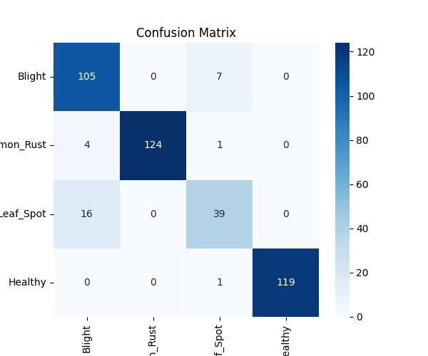
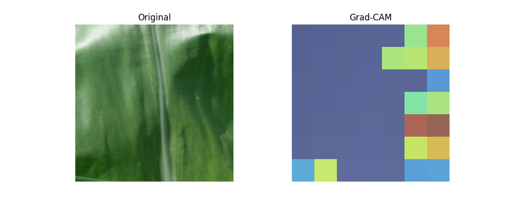

# 🌽 Corn Leaf Disease Detection

An end-to-end deep learning system that detects diseases in corn (maize) leaves from images. The project covers the full pipeline — from model training in Google Colab to a working web application with a Flask backend and browser-based UI.

**Live repo:** [github.com/SriDharshnna/corn_leaf_disease](https://github.com/SriDharshnna/corn_leaf_disease)

---

## 📋 Overview

Corn crops are vulnerable to several foliar diseases that can significantly reduce yield if not identified early. This project uses transfer learning on **EfficientNetB0** to classify corn leaf images into 4 categories, and wraps the trained model in a simple web interface so a user can upload a leaf photo and get an instant prediction.

### Classes detected
| Class | Description |
|---|---|
| **Blight** | Northern Corn Leaf Blight |
| **Common_Rust** | Common rust fungal infection |
| **Gray_Leaf_Spot** | Gray leaf spot disease |
| **Healthy** | No disease present |

---

## 🧠 Model & Approach

- **Backbone:** EfficientNetB0 (ImageNet pre-trained)
- **Input size:** 224 × 224 × 3
- **Training strategy:** Two-phase transfer learning
  1. **Phase 1 — Feature extraction:** base model frozen, only the classification head trained
  2. **Phase 2 — Fine-tuning:** top ~30 layers of the base model unfrozen and trained at a low learning rate (1e-5)
- **Data pipeline:** `tf.data` with caching and prefetching for efficient training
- **Augmentation:** random flip, rotation, zoom, contrast, brightness, and translation applied on-the-fly
- **Class imbalance handling:** class-weighted loss to boost performance on underrepresented classes
- **Callbacks:** EarlyStopping, ReduceLROnPlateau, ModelCheckpoint (best-weights saving)
- **Explainability:** Grad-CAM visualizations to confirm the model focuses on actual lesion regions rather than background artifacts

---

## 📊 Results

**Overall test accuracy: 94%**

| Class | Precision | Recall | F1-score | Support |
|---|---|---|---|---|
| Blight | 0.85 | 0.94 | 0.89 | 112 |
| Common_Rust | 1.00 | 0.96 | 0.98 | 129 |
| Gray_Leaf_Spot | 0.83 | 0.73 | 0.78 | 55 |
| Healthy | 1.00 | 1.00 | 1.00 | 120 |
| **Accuracy** | | | **0.94** | 416 |
| **Macro avg** | 0.92 | 0.91 | 0.91 | 416 |
| **Weighted avg** | 0.94 | 0.94 | 0.93 | 416 |

### Confusion Matrix


### Grad-CAM Visualization


**Note on Gray_Leaf_Spot:** This class shows comparatively lower recall, which is a well-documented, genuine visual overlap in corn disease datasets — Gray Leaf Spot and Northern Leaf Blight lesions can appear very similar (elongated tan/gray lesions running parallel to leaf veins), even to trained observers, especially in early-to-mid disease stages. Class-weighting was applied during fine-tuning to partially address this, improving recall from 0.71 → 0.73 without degrading performance on other classes.

---

## 🏗️ Project Structure

```
corn_leaf_disease/
├── backend/
│   ├── app.py                  # Flask API serving predictions
│   ├── requirements.txt
│   └── model/
│       └── corn_disease_model_FINAL.keras   (tracked via Git LFS)
├── frontend/
│   ├── index.html
│   ├── style.css
│   └── script.js
├── notebooks/
│   └── corn_leaf_disease_training.ipynb     # Full Colab training pipeline
├── results/
│   ├── confusion_matrix.png
│   ├── training_curves.png
│   └── gradcam_example.png
├── reports/
│   └── classification_report.txt
├── .gitattributes
├── .gitignore
└── README.md
```

---

## 🛠️ Tech Stack

- **Model training:** TensorFlow / Keras, EfficientNetB0, Google Colab (GPU)
- **Backend:** Flask, Flask-CORS
- **Frontend:** HTML, CSS, JavaScript (vanilla)
- **Explainability:** Grad-CAM
- **Version control:** Git + Git LFS (for the trained model file)

---

## 🚀 Getting Started

### 1. Clone the repository
```bash
git clone https://github.com/SriDharshnna/corn_leaf_disease.git
cd corn_leaf_disease
```

> This repo uses **Git LFS** to store the trained model file. Make sure Git LFS is installed before cloning:
> ```bash
> git lfs install
> ```

### 2. Set up the backend
```bash
cd backend
pip install -r requirements.txt
python app.py
```
The Flask server will start at `http://127.0.0.1:5000`.

### 3. Launch the frontend
Open `frontend/index.html` directly in your browser, or serve it locally:
```bash
cd frontend
python -m http.server 8080
```
Then visit `http://127.0.0.1:8080`.

### 4. Use the app
Upload a corn leaf image and click **Predict** — the app will return the predicted disease class along with a confidence breakdown across all 4 categories.

---

## 📓 Training Notebook

The full training pipeline — data loading, augmentation, two-phase transfer learning, evaluation, and Grad-CAM — is available in [`notebooks/corn_leaf_disease_training.ipynb`](notebooks/corn_leaf_disease_training.ipynb) and was run on Google Colab with GPU acceleration.

---

## 🔮 Future Improvements

- Collect additional Gray_Leaf_Spot samples to further close the recall gap with Blight
- Experiment with higher-resolution backbones (EfficientNetB3/B4) to capture finer lesion texture
- Deploy the backend to a cloud service (Render, Railway, or Hugging Face Spaces) for public access
- Add a mobile-friendly camera-capture option in the frontend
- Export and benchmark the TFLite version for on-device/edge inference

---

## 📄 License

This project is open-sourced for educational and research purposes. Feel free to fork and build on it.

---

## 🙋 Author

**SriDharshnna** — [GitHub](https://github.com/SriDharshnna)
